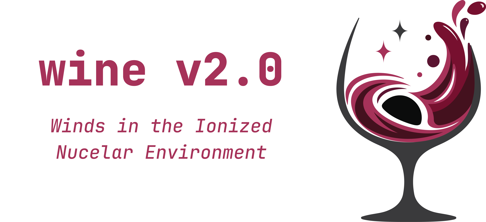
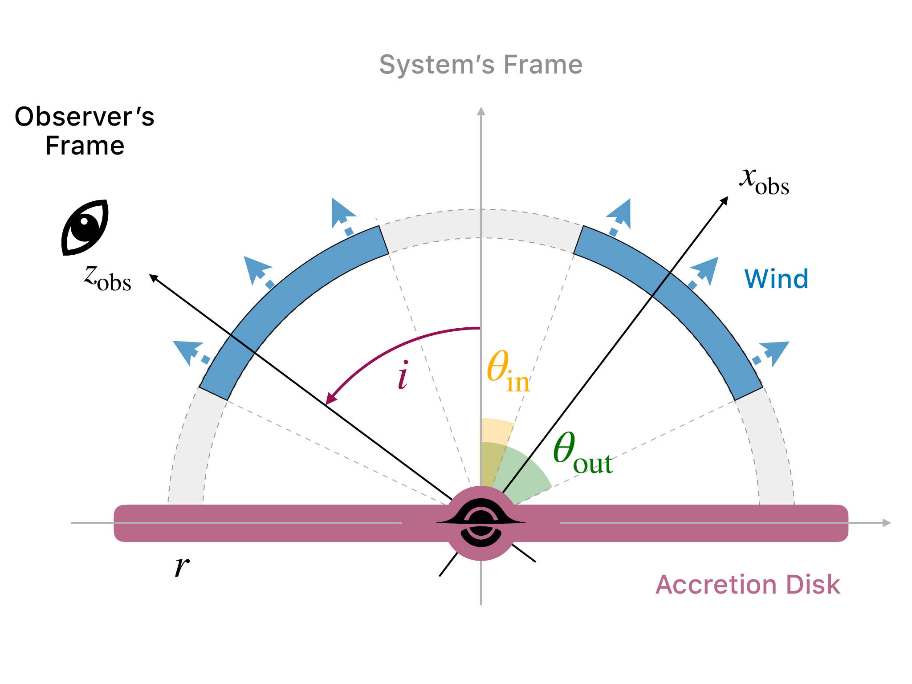

# WINE — Wind in the Ionised Nuclear Environment

WINE is a spectroscopic model for emission and absorption from outflows around compact astrophysical sources, particularly accreting black holes. It combines fast analytical outflow profiles with accurate special relativistic effects and viewing geometry, treating both spectral components consistently. It is designed for outflows up to mildly relativistic speeds, including ultra-fast outflows in active galactic nuclei (AGN), and can be used to explore winds in X-ray binaries and gamma-ray bursts when its assumptions apply.

## WINE `v2.0`

WINE `v2.0` separates the wind model from the calculation of its rest-frame spectrum. It acts as a post-processing layer: users can supply their own spectra or generate them with photoionisation codes such as CLOUDY or XSTAR, then apply WINE's relativistic emission and absorption models. This makes it practical to explore individual wind shells and their geometry without rerunning a photoionisation calculation at every model evaluation. The present shell-based approach is aimed primarily at approximately Compton-thin winds (roughly $N_\mathrm{H} \lesssim 10^{24}\,\mathrm{cm}^{-2}$); its validity still depends on the supplied spectra and the physical assumptions of a particular application.

This direction is motivated in part by the detail now accessible in high-resolution X-ray spectra from XRISM.

The [`wine v1` implementation](https://baltig.infn.it/ionisation/wine) remains available as a complementary tool. It models a connected, initially homogeneous outflow through successive XSTAR calculations, retaining the coupled wind treatment useful for that approach.

## What is in this repository?

| Path | Contents |
| --- | --- |
| [`src/wine/`](src/wine/) | Python wind kernels, slab models, standalone spectral-grid interpolation, and OGIP table reader |
| [`xspec/`](xspec/) | Local XSPEC models for emission profiles and relativistic spectral shifts |
| [`procedures/`](procedures/) | XSPEC commands for WINE viewing-angle covariance and profile limits |
| [`tests/`](tests/) | Python tests for grids, table reading, and model evaluation |
| [`docs/`](docs/) | API, spectral input, XSPEC, and development documentation |

WINE reads precomputed spectra; it does not run CLOUDY or XSTAR. No production spectral grid is bundled with this repository.

The Python models can be used in any Python workflow, including custom fitting or simulation routines. XSPEC is one supported interface; the example below shows how to use the models there.

## Python

For Python 3.10 or newer, install in an environment of your choice:

```bash
git clone https://github.com/pier-astro/wine.git
cd wine
python -m pip install -e '.[fits]'
```

The `fits` extra provides Astropy for OGIP FITS tables. NumPy and SciPy are the core Python dependencies. Import the model with `import wine`; see the [Python guide](docs/python.md) for array and table inputs, units, and examples.

`wine.SpectralGrid` can also interpolate spectra directly in Python, without evaluating a wind model. It accepts multidimensional NumPy arrays or OGIP tables or another compatible tool. Spectral values default to logarithmic interpolation; choose `interpolation="linear"` when needed.

## XSPEC quick start

Initialize HEASoft/XSPEC and build the local models:

```bash
cd xspec
./build.sh
```

In XSPEC, load WINE and its viewing-angle procedures:

```tcl
lmod wine /absolute/path/to/wine/xspec
source /absolute/path/to/wine/procedures/wine_inclination.tcl
source /absolute/path/to/wine/procedures/wine_profile.tcl
```

The `source` commands apply to the current session. The [procedure guide](procedures/README.md) explains permanent installation.

Load your data and responses from an XSPEC command file:

```tcl
@data.xcm
```

Define a model with a wind-shifted absorption table (e.g., `cloudy.mmod`) and wind-broadened emission table (e.g., `cloudy.amod`):

```tcl
model TBabs*(wind*mtable{cloudy.mmod})*(powerlaw+windemlos*atable{cloudy.amod})
```

The table filenames are examples: supply your own compatible multiplicative and additive spectra. XSPEC prompts for their parameters. Inspect them and set suitable initial values before fitting. For this expression, components 2 and 5 are `wind` and `windemlos`; locate their velocity parameter numbers, link them, and fit:

```tcl
show parameters
set vabs [lindex [tcloutr compinfo 2] 1]
set vem [lindex [tcloutr compinfo 5] 1]
newpar $vem = p$vabs
set uincl [expr {$vem + 1}]
fit
```

The WINE suite provides three versions of the emission convolution model:

- `windem` uses `vout`, `incl`, `tout`, and `tin`: the wind velocity, viewing angle, outer opening angle, and inner opening angle. It leaves the viewing angle independent of the wind boundaries. If the model should require the line of sight to cross the wind, use `windemlos`.
- `windemlos` enforces a line of sight through the wind. It replaces `incl` with the dimensionless fraction `uincl` (between 0 and 1), so `incl = tin + uincl × (tout − tin)`. The example above uses this model to connect emission and absorption geometry.
- `windemoff` enforces a line of sight outside the wind. It replaces `incl` with `uview` (between 0 and 1) and uses a frozen `region` switch to select one of two possible geometries. For `region = 1`, the sightline lies beyond the outer wind boundary: `incl = tout + uview × (90° − tout)`. For `region = 0`, it lies in the polar cavity: `incl = (1 − uview) × tin`.

To explore `windemoff`, fit `region = 1` and record the fit statistic, then set `region = 0` and refit. Compare the two solutions for the same data and statistic; keep `region` fixed within each fit. An absent absorption feature alone does not establish that the sightline misses the wind.



### Error estimation

With a gradient-based fit method such as Levenberg–Marquardt (`leven`), XSPEC reports local parameter uncertainties from the fit covariance matrix. These are a quick guide when the fit statistic is approximately quadratic around the minimum. They can be misleading near parameter boundaries, with strong degeneracies, or when the statistic has a non-quadratic or multimodal shape.

For `windemlos` and `windemoff`, XSPEC's uncertainty on `uincl` or `uview` describes a dimensionless fraction, not the uncertainty on the physical viewing angle. That angle also depends on `tin` and `tout`. To propagate the full covariance to a local 1-sigma uncertainty in degrees, use:

```tcl
wineinclcov $uincl
```

This includes covariance with free opening angles but retains the local Gaussian approximation. With no XSPEC chains loaded, obtain profile limits on the ordinary free model parameters by refitting the others at each trial value:

```tcl
error 1. 1-[tcloutr modpar]
```

The resulting interval for `uincl` is **not** generally an interval for the viewing angle if either opening angle varies. WINE can profile the physical angle directly by holding it fixed while refitting the other parameters:

```tcl
wineinclprofile 1. $uincl
puts $xspec_tclout
```

`wineinclprofile` is WINE's counterpart to XSPEC `error` for the **physical viewing angle**: it fixes that angle and refits the other free parameters, including the opening angles. It prints the confidence range in degrees. `$xspec_tclout` provides unrounded limits and diagnostic flags for scripts; see the [procedure reference](procedures/README.md#wineinclprofile). As with any profile interval, fit convergence and the behavior near boundaries matter.

`wineinclerror` is a convenience wrapper around XSPEC `error` for a directly fitted `incl`, or for `uincl`/`uview` when both opening angles are frozen and unlinked. In the latter case it converts the native limits to degrees. This is also a profile in that special case, but cannot profile the physical angle when the opening angles are free. See the [XSPEC guide](docs/xspec.md) for details. In XSPEC `error` and `wineinclprofile`, the leading decimal is **Δstat**, not a sigma value; `1.` corresponds approximately to 1 sigma for one parameter of interest.

### MCMC alternative

For posterior intervals, XSPEC can sample the free parameters jointly. After fitting, a minimal example is:

```tcl
chain type gw
chain walkers 20
chain burn 2000
chain length 20000
chain run wine_chain.fits
chain stat $uincl
plot chain $uincl
```

The lengths are illustrative: set appropriate priors and inspect chain mixing and convergence before using its intervals. MCMC samples the free parameters *jointly*, so the dependence of `incl` on `uincl` or `uview` and the opening angles does not require a new fit parameterization. For **each retained sample**, calculate the physical angle with the relevant formula above, using sampled values for free parameters and fixed values for frozen ones. Then take quantiles of the resulting angle samples. This preserves correlations and nonlinear effects; transforming only the separate marginal error bars on `uincl` or `uview` would not. For `windemoff`, analyse the two fixed `region` cases separately. The FITS chain can also be analysed outside XSPEC. Posterior credible intervals depend on the chosen priors and differ from profile confidence intervals.

XSPEC automatically loads a completed chain. While one is loaded, `error` reports intervals from chain samples rather than doing profile refits. Run `chain clear` to unload chains before requesting an `error` profile; this leaves the saved FITS files intact. See the [XSPEC chain guide](https://heasarc.gsfc.nasa.gov/docs/software/xspec/manual/node105.html) for settings and diagnostics.

The [XSPEC guide](docs/xspec.md) also covers the models, tests, and `./clean.sh` rebuild workflow. Generated binaries and local build files are excluded from Git.

## Documentation

- [Python models and spectral inputs](docs/python.md)
- [XSPEC models and local build](docs/xspec.md)
- [Repository structure and development](docs/development.md)

The physical model and its domain of validity will be documented in greater depth alongside the associated publication.
<!-- The earlier WINE model is described in [Luminari et al. (2024)](https://arxiv.org/abs/2410.13933). -->

If WINE supports a publication, please acknowledge the project. Citation guidance will be added with the accompanying paper; questions and feedback are welcome through the [project repository](https://github.com/pier-astro/wine).

WINE `v2.0` is distributed under [GPL-3.0-or-later](LICENSE).
